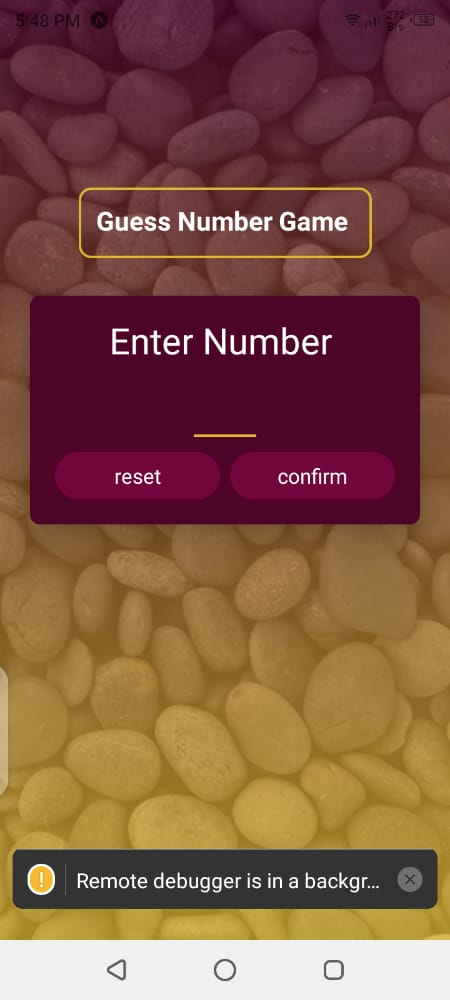
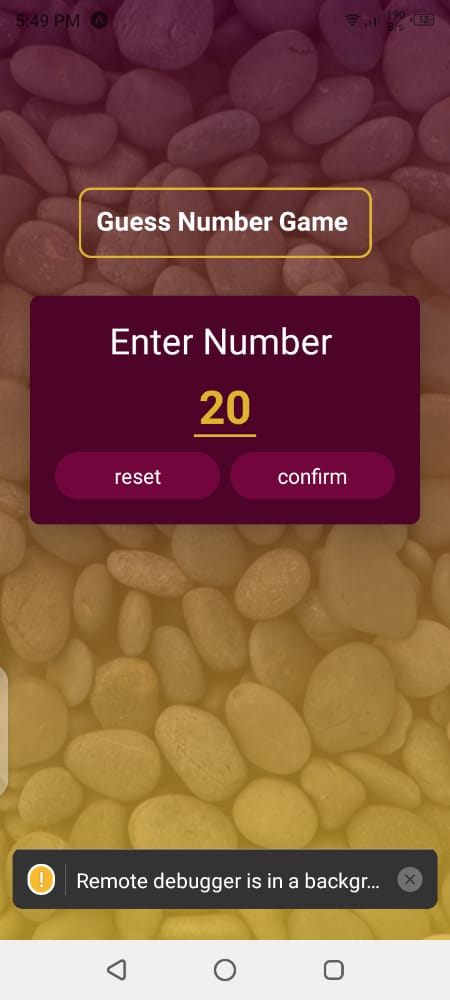
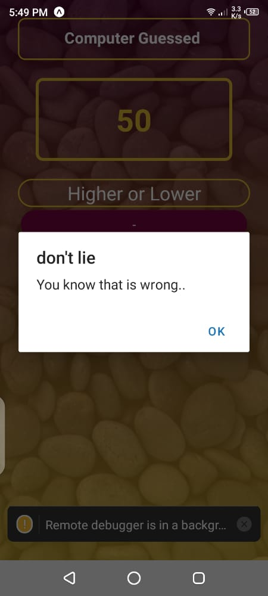

# Number Guessing Game

The number Guessing Game is just as it sounds. A number guessing  game. The user provides a number and the phone has to randomly gues what the user had as an input. 
If the number guessed by the phone is greater, feel free to instruct that the number is greater than the one expected. If number predicted is lesser, then instruct it as so. 
The app is generally supposed to give a deeper dive into the following three things
* Use of hooks, useState, useEffect mostly.
* Navigation by use of states between screens.
* Stylesheet styling of the app layout. 

## Getting Started
> _tip_: Follow installation procedure carefully.. 

### Prerequisite
1. The depends on the Node Package Manager (NPM). You will need to download and install Node from [https://nodejs.com/en/download](https://nodejs.org/en/download/). This will allow you to be able to run `npm` commands.
2. Install `expo` from `npm install -g expo-cli`
3. Install expo-go App on your phone. 

#### Getting started
1. Pull the repository to your local machine and install the dependencies by using `npm install .` in the same folder as the `package.json`
This will install all the dependencies required including the expo and expo-cli

2. `cd` into the folder on the terminal on your local machine and run command `npm start`
This will start  the metro-bundler on your terminal and a QR code on the logs. 

3. In your phone launch the expo-go app and scan the QR code. On iPhone, use the camera utility for scanning.
This will start the app on your phone and you are ready to play. 

### screenshots

